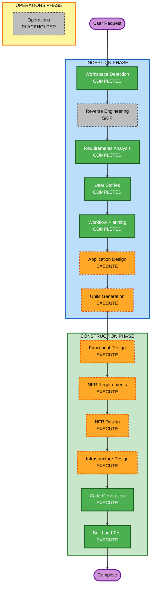

# 実行計画書

## 詳細分析サマリー

### 変更スコープ

- 変化種別: 新規アプリケーション構築
- 主対象: Android ネイティブアプリ、セッション進行制御、コンテンツ生成連携、音声生成サーバー連携、BGM 制御、将来拡張のためのセッション文脈保持
- 関連領域: モバイル UI、オーディオ再生、ネットワーク連携、将来の推薦基盤に備えるデータ識別設計

### 影響評価

- ユーザー影響: あり。プロダクト価値の中心が睡眠導入体験であり、開始操作、再生テンポ、暗い画面、音環境が直接体験を左右する。
- 構造影響: あり。モバイルクライアント、コンテンツ供給、音声生成連携、セッション制御を含む新規アーキテクチャが必要。
- データモデル影響: あり。コンテンツ種別、再生モード、セッション文脈、将来拡張に備える識別情報の設計が必要。
- API 影響: あり。AiVisSpeech を用いた自前音声生成サーバーとの連携契約、および AI 生成コンテンツ取得インターフェースが必要。
- NFR 影響: あり。低刺激 UX、音声と BGM の品質、待ち時間、通信失敗時の劣化制御、保守性が設計に影響する。

### リスク評価

- リスクレベル: High
- 根拠: 新規のユーザー向けモバイルアプリであり、睡眠導入という体験品質が主価値であることに加え、自前音声生成サーバー連携と継続再生制御を伴うため。
- ロールバック複雑度: Moderate
- テスト複雑度: Complex

## ワークフロー可視化

### Mermaid 図



### テキスト代替

```text
Phase 1: INCEPTION
- Workspace Detection: COMPLETED
- Reverse Engineering: SKIP (greenfield)
- Requirements Analysis: COMPLETED
- User Stories: COMPLETED
- Workflow Planning: COMPLETED
- Application Design: EXECUTE
- Units Generation: EXECUTE

Phase 2: CONSTRUCTION
- Functional Design: EXECUTE
- NFR Requirements: EXECUTE
- NFR Design: EXECUTE
- Infrastructure Design: EXECUTE
- Code Generation: EXECUTE
- Build and Test: EXECUTE

Phase 3: OPERATIONS
- Operations: PLACEHOLDER
```

## 推奨ステージ

### INCEPTION PHASE

- [x] Workspace Detection - COMPLETED
  - 根拠: Greenfield と判定済み。
- [x] Reverse Engineering - SKIP
  - 根拠: 既存コードが存在しないため。
- [x] Requirements Analysis - COMPLETED
  - 根拠: 要件定義書と確認票が完成しているため。
- [x] User Stories - COMPLETED
  - 根拠: ペルソナとユーザーストーリーが承認済みレビュー段階に入るため。
- [x] Workflow Planning - COMPLETED
  - 根拠: 本実行計画書を作成したため。
- [ ] Application Design - EXECUTE
  - 根拠: 新規アプリの主要コンポーネント、責務分離、外部連携境界を具体化する必要があるため。
- [ ] Units Generation - EXECUTE
  - 根拠: Android クライアント、セッション制御、音声連携、コンテンツ供給などを実装単位へ分割する必要があるため。

### CONSTRUCTION PHASE

- [ ] Functional Design - EXECUTE
  - 根拠: モード差分、連続再生、メニュー操作、セッション進行の詳細ロジックを固める必要があるため。
- [ ] NFR Requirements - EXECUTE
  - 根拠: 待ち時間、音質、低刺激 UX、保守性、ネットワーク劣化時の扱いを具体要件へ落とす必要があるため。
- [ ] NFR Design - EXECUTE
  - 根拠: NFR がアーキテクチャと実装方式に直接影響するため。
- [ ] Infrastructure Design - EXECUTE
  - 根拠: 自前音声生成サーバー、AI 生成基盤接続、ネットワーク境界、運用前提を設計する必要があるため。
- [ ] Code Generation - EXECUTE
  - 根拠: 実装は必須であり、複数責務を段階的にコードへ落とし込む必要があるため。
- [ ] Build and Test - EXECUTE
  - 根拠: 音声、セッション進行、UI 操作、連携境界の動作検証が必要なため。

### OPERATIONS PHASE

- [ ] Operations - PLACEHOLDER
  - 根拠: 現行 AI-DLC では将来拡張扱いのため。

## ステージをスキップする判断

- Reverse Engineering をスキップする。
  - 理由: Greenfield のため既存資産分析が不要。

## 推奨実行順序

1. Application Design
2. Units Generation
3. Functional Design
4. NFR Requirements
5. NFR Design
6. Infrastructure Design
7. Code Generation
8. Build and Test

## 変更単位の見立て

- 単位 1: Android クライアントの開始前設定と暗い画面 UI
- 単位 2: セッション進行制御と連続再生ロジック
- 単位 3: 音声生成サーバー連携と読み上げパイプライン
- 単位 4: AI / 固定コンテンツ供給と情景テーマ制御
- 単位 5: BGM 制御と音量フェード
- 単位 6: 将来パーソナライズに備える識別情報保持

## 見積もり

- 総ステージ数: 12
- 完了済みステージ数: 5
- 今後の実行ステージ数: 8
- 想定進め方: 1 回の設計フェーズと複数回の実装・検証イテレーション

## 成功条件

- 主目標: 低刺激で連続再生される睡眠導入アプリを Android 上で成立させる。
- 主要成果物:
  - アプリ全体の設計成果物
  - 実装単位の分解結果
  - Android クライアントと音声生成連携を含むコード
  - 体験品質を確認するテストとビルド手順
- 品質ゲート:
  - 開始前操作が少なく、暗い画面中心の導線であること
  - 読み上げ、BGM、連続再生が睡眠導入体験を阻害しないこと
  - 自前音声生成サーバー連携を前提とした失敗時の扱いが設計されていること
  - 将来拡張のための識別情報保持が実装計画に含まれていること
